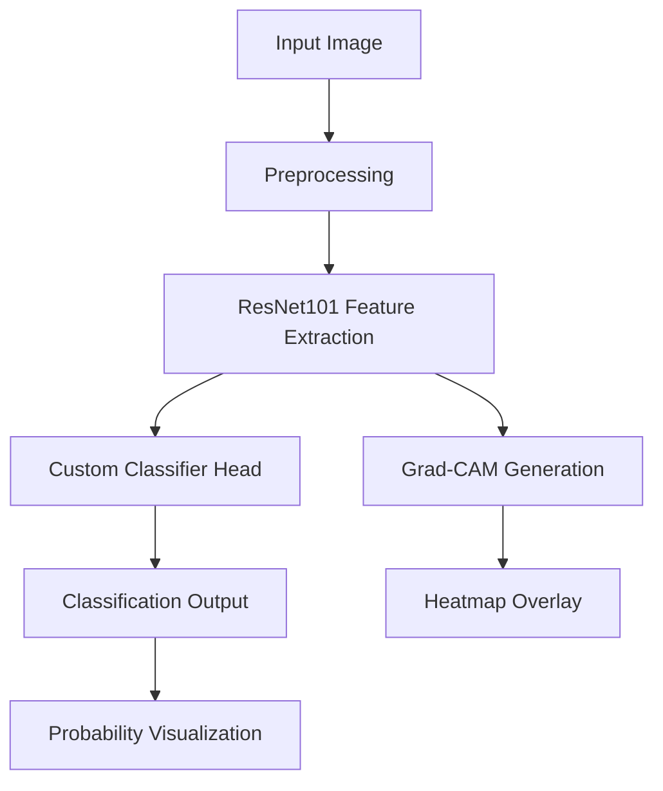

# Histopathology Cancer Classifier with Explainable AI


## Table of Contents
1. [Project Overview](#project-overview)
2. [Key Features](#key-features)
3. [Technical Architecture](#technical-architecture)
4. [Installation Guide](#installation-guide)
5. [Usage Instructions](#usage-instructions)
6. [Model Details](#model-details)
7. [Explainability Methods](#explainability-methods)
8. [Directory Structure](#directory-structure)
9. [Dependencies](#dependencies)
10. [Sample Data](#sample-data)

## Project Overview

This application is a deep learning-based system for classifying histopathology images of lung and colon tissues into five distinct categories. The system combines high-accuracy classification with explainable AI techniques to provide interpretable results for medical professionals and researchers.

**Clinical Significance**: The classifier can assist pathologists by:
- Providing second-opinion diagnoses
- Highlighting diagnostically relevant regions
- Reducing analysis time for routine cases

## Key Features

### 1. Multi-Class Classification
- **Colon Adenocarcinoma** (Malignant)
- **Colon Normal Tissue** (Benign)
- **Lung Adenocarcinoma** (Malignant)
- **Lung Normal Tissue** (Benign)
- **Lung Squamous Cell Carcinoma** (Malignant)

### 2. Explainability Visualizations
#### Grad-CAM Heatmaps

*Shows class-discriminative regions at convolutional layer resolution*

#### Guided Grad-CAM

*Combines high-resolution guided backpropagation with Grad-CAM for precise localization*

### 3. Interactive Interface
- Sample image gallery
- Real-time upload and analysis
- Probability distribution visualization
- Sidebar controls for explanation methods

## Technical Architecture



## Installation Guide

### Prerequisites
- Python 3.8+
- pip package manager
- NVIDIA GPU (recommended) with CUDA 11.7

### Step-by-Step Installation

1. Clone the repository:
   ```bash
   git clone https://github.com/AbidHasanRafi/histopathology-cancer-classifier-app.git
   cd histopathology-cancer-classifier-app
   ```

2. Create and activate virtual environment:
   ```bash
   python -m venv venv
   source venv/bin/activate  # Linux/Mac
   venv\Scripts\activate    # Windows
   ```

3. Install dependencies:
   ```bash
   pip install -r requirements.txt
   ```

4. Download the trained model on the LC25000 dataset using our architecture

## Usage Instructions

### Running the Application
```bash
streamlit run app.py
```

### Interface Components
1. **Sidebar Controls**:
   - Sample image selector
   - Explanation method toggle (Grad-CAM/Guided Grad-CAM)
   - Debug mode switch

2. **Main Panel**:
   - Image display area
   - Prediction results card
   - Probability distribution chart
   - Explanation visualizations

### Analysis Workflow
1. Select sample image or upload your own
2. View automatic classification results
3. Examine explanation heatmaps
4. Compare with known pathological features

## Model Details

### Architecture
```python
ResNet101(
  (conv1): Conv2d(3, 64, kernel_size=(7, 7), stride=(2, 2), padding=(3, 3), bias=False)
  (bn1): BatchNorm2d(64, eps=1e-05, momentum=0.1, affine=True, track_running_stats=True)
  (layer1): Sequential(...)
  (layer2): Sequential(...)
  (layer3): Sequential(...)
  (layer4): Sequential(...)
  (fc): Sequential(
    (0): Dropout(p=0.5)
    (1): Linear(in_features=2048, out_features=512, bias=True)
    (2): ReLU()
    (3): Dropout(p=0.3)
    (4): Linear(in_features=512, out_features=5, bias=True)
  )
)
```

## Explainability Methods

### Grad-CAM Implementation
```python
def grad_cam(model, img_tensor, target_class=None):
    # Register hooks
    feature_maps = []
    gradients = []
    
    def forward_hook(module, input, output):
        feature_maps.append(output.detach())
    
    def backward_hook(module, grad_input, grad_output):
        gradients.append(grad_output[0].detach())
    
    # Target the last convolutional layer
    target_layer = model.layer4[-1].conv2
    
    # Calculate gradients and feature importance
    # ... (see full implementation in app.py)
    
    return cam, target_class
```

### Guided Grad-CAM
Combines:
1. Standard Grad-CAM for localization
2. Guided backpropagation for edge preservation
3. Element-wise multiplication of both

## Directory Structure

```
histopathology-cancer-classifier/
├── app.py                # Main application logic
├── best_model.pth        # Pretrained model weights
├── requirements.txt      # Dependency specifications
├── assets                
└── samples/              # Example histopathology images
    ├── colon_aca.jpeg    # Colon adenocarcinoma
    ├── colon_n.jpeg      # Normal colon
    ├── lung_aca.jpeg     # Lung adenocarcinoma
    ├── lung_n.jpeg       # Normal lung
    └── lung_scc.jpeg     # Lung squamous cell carcinoma
```

## Dependencies

### Core Requirements
| Package       | Version | Purpose |
|--------------|---------|---------|
| streamlit    | ≥1.22   | Web interface |
| torch        | ≥2.0    | Deep learning framework |
| torchvision  | ≥0.15   | Image transformations |
| opencv-python| ≥4.7    | Image processing |
| matplotlib   | ≥3.7    | Visualization |
| seaborn      | ≥0.12   | Statistical visuals |
| pillow       | ≥9.5    | Image handling |

See full list in `requirements.txt`

## Sample Data

The repository includes representative samples:

| File              | Tissue Type                  | Malignancy | Key Features |
|-------------------|------------------------------|------------|--------------|
| `lung_aca.jpeg`   | Lung Adenocarcinoma          | Malignant  | Gland formation, nuclear atypia |
| `lung_scc.jpeg`   | Lung Squamous Cell Carcinoma | Malignant  | Keratin pearls, intercellular bridges |
| `colon_aca.jpeg`  | Colon Adenocarcinoma         | Malignant  | "Dirty necrosis", cribriform pattern |
| `lung_n.jpeg`    | Normal Lung Tissue           | Benign     | Uniform alveoli, thin septa |
| `colon_n.jpeg`   | Normal Colon Tissue          | Benign     | Regular crypt architecture |